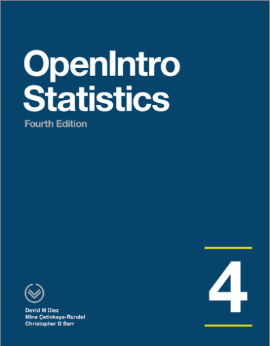

```{r setup, include = FALSE}
library(webexercises)
library(tinytex)
library(dplyr)
library(knitr)
library(ggplot2)
library(infer)
knitr::opts_chunk$set(echo = FALSE)
```

```{r eval=FALSE, echo=FALSE}
install.packages("bookdown")
```

```{r include=FALSE, echo=FALSE}
knitr::write_bib(c(
  .packages(), 'bookdown', 'knitr', 'rmarkdown'
), 'packages.bib')
```

# Welcome to Lab 5 {-}

## Intended Learning Outcomes {-}

```{r graphic1, echo = FALSE, out.width = "100%", fig.cap = ""}

```

In this lab, we will investigate the ways in which the statistics from a random sample can serve to make inference and **test hypotheses** about the true parameter in the larger population. We will explore here inference methods for categorical data. Before we begin however, let's revisit the difference between categorical and numerical data.

**Categorical Data:** Data where an observation can belong to one of a certain fixed number of categories or groups. For example, someone's bloodtype. Your bloodtype can be one of A, B, AB or O. 

**Numerical Data:** Data in the form of numbers; rather than being defined as a member of some group or category. It also must make sense for calculations to be performed on those numbers, such as adding them or taking averages of them. This is important, for example a phone number is a number but it doesn't make sense to add phone numbers together. An example of numerical data is your height. It's measured with a number you can perform calculations directly on such as averages. Another example would be a count of the number of patients seen at a GP Surgery in a day. 

The material within this lab has been based on OpenLearn Chapters 6 <a href="https://www.openintro.org/redirect.php?go=os4_tablet&referrer=/stat/os4.php#page=206">OpenIntro Page 206</a>. Feel free to refer back to the materials to help you within this lab. 

<br>

## Credit where credit is due {-}



The labs in S1Y/Z are a derivative of the labs on the  <a href="https://www.openintro.org/book/os/">OpenIntro Statistics website</a> by the <a href="https://www.openintro.org/team/"> OpenIntro team</a> used under a <a href="https://creativecommons.org/licenses/by-sa/4.0/">Creative Commons Attribution-ShareAlike 4.0 International License</a>.  Some of the artwork used is by <a href="https://github.com/allisonhorst/stats-illustrations">@allison_horst</a>

<br>
